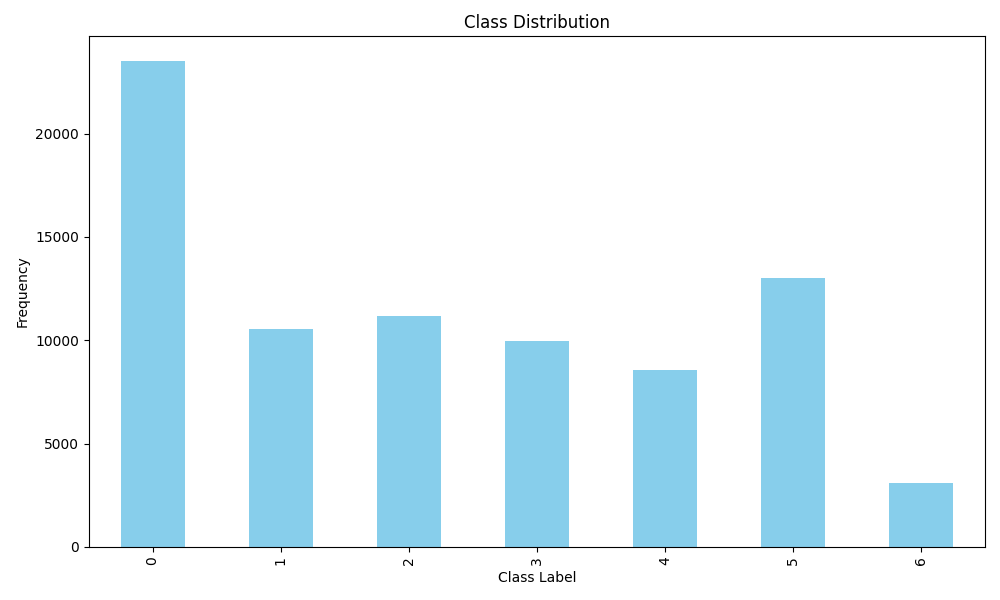
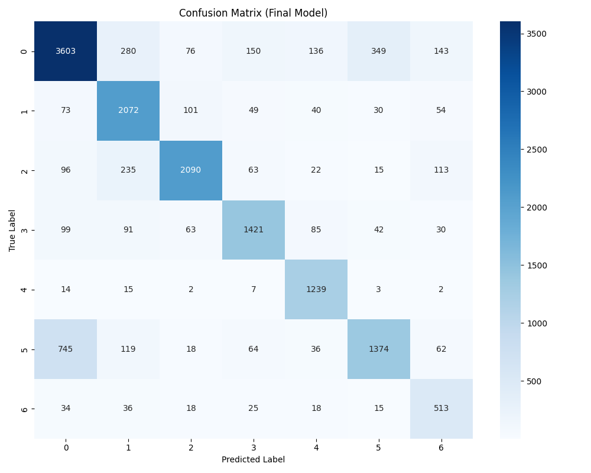
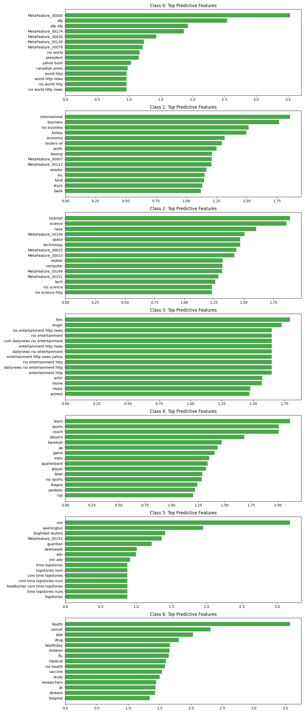

# Scientific Validation Report (Final World Model)

## 1. Split Hypothesis Test (Leakage Check)
- **Random K-Fold F1**: 0.7166
- **Time-Series Split F1**: 0.7631
> [!TIP]
> **Positive Generalization**: Time-series performance is superior, indicating robust learning of future trends.

## 2. Final Model Architecture
**Model**: LinearSVC
**Validation Macro-F1**: 0.7631

## 3. Visualizations

